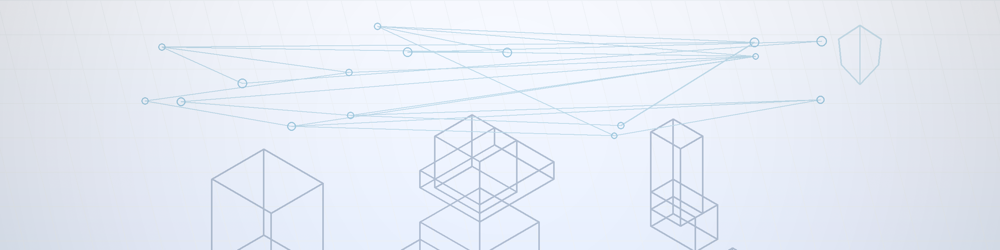

<!--
Profile README for github.com/jglee96
Keep it crisp, measurable, and link-first.
-->

  <picture>
    <source media="(prefers-color-scheme: dark)" srcset="./assets/github-banner-jglee96-dark-2560x640.png">
    <source media="(prefers-color-scheme: light)" srcset="./assets/github-banner-jglee96-light-2560x640.png">
    
  </picture>

  Frontend / Product Engineer — UX × Performance × AI Agent systems 
  <b>측정 가능한 개선</b>과 <b>변경에 강한 구조</b>를 좋아합니다.

  <a href="https://zakklee.dev">Blog</a> ·
  <a href="https://www.linkedin.com/in/zakklee">LinkedIn</a> ·
  <a href="https://zakklee.dev/">Blog</a> ·
  <a href="https://codepen.io/jglee96">CodePen</a> ·
  <a href="https://zakkdev.vercel.app">Lab</a>

---

## What I do

- **Frontend engineering**: React/TypeScript 기반 제품 개발, 디자인 시스템/상태관리/렌더링 성능 최적화
- **AI UX**: LLM 결과를 “사용자가 바로 행동”할 수 있게 만드는 인터랙션/피드백 루프 설계
- **Policy/Rule aware systems**: 규칙(법규/정책/제약) 기반 의사결정·최적화 문제를 제품 형태로 만드는 것에 관심

> 지금은 **SWING**에서 제품 개발을 하고 있고, 업무 바깥에서는 **Go / Rust(Tauri) / FastAPI**로 도메인 실험을 하고 있어요.

---

## Tech I use often

- **Frontend**: React, TypeScript, Next.js/Vite, Tailwind, (shadcn-style primitives), Nx/monorepo
- **Product engineering**: design systems, performance profiling, state management, DX automation
- **Backend/Infra (when needed)**: FastAPI, SQLAlchemy, SQLite/Postgres, AWS
- **Desktop / Tools**: Tauri, Rust, CodeMirror
